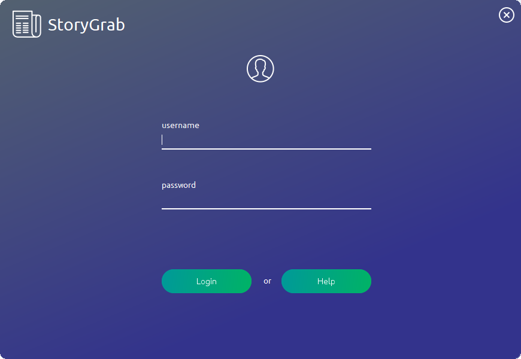

# StoryGrab
StoryGrab takes a list of news sources (no limit) and searches them for the specified keyword. Required libraries are all included in repository. 
### IA write-up

#### Criterion A: Planning

 
The problem I am tackling for my IA is for the ComOps department at AEP. ComOps deals with the buying and selling of power. They needed a way to find news about the price of power and really all things that would interest that department on consumer sites. The goal of my program will be to get a list of webpages that could be potentially relevant to a certain keyword. Google does not do this for them because Google a) does not do the best job of sorting by relevance in this instance, and b) does not write to a database. The client’s name is Joe Sheridan and he is in the ComOps department. A family member of mine has worked with him on a few occasions and that’s how I got in contact with him.
My Java program will search a list of sources for a given keyword and write the output to a database sorted by relevance. The sources will include most consumer news sites and will also include a Twitter API as well as the option to add more sources. Pre-installed sources will include
*http://bbc.com/
*http://foxnews.com/
*http://www.huffingtonpost.com/
*http://www.nbcnews.com/
*http://www.nytimes.com/
*http://www.wsj.com/
*http://www.usatoday.com/
*http://news.google.com/
*http://www.rollcall.com
*http://www.latimes.com
*http://www.wired.com
*http://www.cnn.com
*http://www.npr.org
*http://abcnews.go.com/
*https://www.usnews.com/news
*https://www.yahoo.com/news/
*https://www.ap.org/en-us/

 All sources will be searched recursively but will never read duplicate links. Loops and recursion will be an essential part needed for searching. It will need to write to a database, likely Derby. GUI will be a very large part of this as I will not be the one using it. It must be intuitive, easy to follow, and include a help menu. The sorting will be done in two stages: one, a ‘dumb’ classifier (in Java) will read the data and sort it by the number of times the search keyword appears, and two, a ‘smart’ classifier (in Python). The smart classifier will be in Python because of the wealth of libraries available to use. First, the program will start with a list of sources. Then, those sources will be read into a class that will explore each link, read the article it points to, and search it for the given keyword. If they keyword is found, it will write it to a file AND a Vector set. The Vector data structure will be used to hold all links of any relevance to the keyword. Vector will be used because part of the program will involve multithreading, and Vector is thread-safe. Then, the Python classifier will take that file as input and explore each link in the file. A Latent Dirichlet Allocation model will be used to sort the data based suspected relevance to the keyword. This will output to a database, and this database will be able to be accessed by the user but in only read-only mode. The user will then be able use that data however they wish.

# Screenshots: 
Login screen:

Main screen (current):
 
In action:

